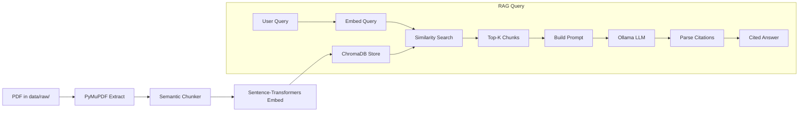

# Arabic-English RAG Chatbot

[](https://www.python.org/downloads/)
[](https://opensource.org/licenses/MIT)
[](https://github.com/YoussefOraby/arabic-english-rag-chatbot/actions/workflows/ci.yml)
[](tests/)

> Ask questions about your Arabic and English PDF documents. Get cited answers with `[page X]` from your files — powered by local LLM (Ollama), multilingual embeddings, and ChromaDB.

> **Why this project?** Built as a portfolio project targeting Egyptian AI engineering roles. Arabic NLP support is a key differentiator — companies like Valeo Egypt, Ericsson Egypt, and Capgemini Cairo explicitly list Arabic NLP in junior AI roles. This project demonstrates end-to-end RAG implementation with bilingual support.

---

## Demo Examples

**English Q&A (pyramids.pdf):**
```
Q: What is the Great Pyramid of Giza?
A: The Great Pyramid of Giza is the largest Egyptian pyramid,
   built as a tomb for Pharaoh Khufu [page 1]. It was the
   tallest man-made structure for over 3,800 years [page 3].
```

**Arabic Q&A (valeo-code-of-business-ethics-2023_ar.pdf):**
```
Q: ما هي قيم شركة فاليو؟
A: قيم شركة فاليو تشمل: التجارية بزناهة، ثقافة الأخلاقيات
   والامتثال، الحفاظ على معاييرنا العالية، المنافسة الشريفة
   [page 2,4,18,22].
```

**Unsupported question:**
```
Q: What is the stock price of Apple?
A: لا أعرف إجابة هذا السؤال بناءً على المستندات المتوفرة.
   (I cannot answer this question based on the available documents.)
```

**Citation format:**
```
[page X]       — Single page source
[page X,Y]    — Multiple pages from same document
[page 1][page 3] — Multiple citations in one answer
```

### Evaluation Results (hybrid mode, llama3.2:3b)

| Metric | Value |
|--------|-------|
| English questions answered | 3/3 (100%) |
| Arabic questions answered | 3/3 (100%) |
| Avg latency (English) | ~25s |
| Avg latency (Arabic) | ~17s |

---

## Features

- **Arabic + English** — chat in either language, answers match your language
- **Real-time streaming** — tokens appear as they're generated (no waiting)
- **Semantic chunking** — sentence-boundary + embedding similarity for coherent chunks
- **Cited answers** — every response includes `[page X]` source citations
- **Hybrid search** — BM25 + ChromaDB dense search combined via RRF fusion for better Arabic retrieval
- **PDF upload in UI** — drag-and-drop new PDFs, instantly indexed
- **Chat history** — conversations auto-saved, load previous sessions
- **RTL support** — Arabic text renders right-aligned properly
- **REST API** — FastAPI backend with `/query`, `/health`, `/stats` endpoints
- **100% local** — no cloud dependencies, runs on your machine with Ollama

---

## Project Journey

| Phase | Description | Status |
|-------|-------------|--------|
| 1 | Environment setup | ✅ |
| 2 | English PDF extraction + chunking (pyramids.pdf) | ✅ |
| 3 | Multilingual embeddings + ChromaDB | ✅ |
| 4 | RAG chain + Ollama local LLM | ✅ |
| 5 | Streamlit UI with streaming + citations | ✅ |
| 6 | Arabic RAG pipeline (Valeo ethics document) | ✅ |
| 7 | PDF upload feature + bilingual testing | ✅ |

---

## Architecture

### Data Pipeline



### System Components

| Component | Technology | Purpose |
|-----------|-----------|---------|
| PDF Extraction | PyMuPDF (fitz) | Text extraction from PDF files |
| Chunking | Custom semantic splitter | Sentence-boundary + similarity chunking |
| Embeddings | sentence-transformers (384-dim) | Multilingual text → vectors |
| Vector Store | ChromaDB | Local persistent vector database |
| LLM | Ollama (llama3.2:3b) | Answer generation |
| Web UI | Streamlit | Chat interface with RTL support |
| REST API | FastAPI | Programmatic access |
| Config | Pydantic + YAML | All settings tunable |

---

## Quick Start

### Prerequisites

- Python 3.11+
- [Ollama](https://ollama.com) for local LLM

### Setup

```bash
# Clone the repository
git clone https://github.com/YoussefOraby/arabic-english-rag-chatbot.git
cd rag-chatbot

# Create virtual environment
python -m venv .venv
.venv\Scripts\activate         # Windows
source .venv/bin/activate      # macOS/Linux

# Install dependencies
pip install -e ".[dev]"

# Pull the LLM model
ollama pull llama3.2:3b

# Generate sample PDFs (or drop your own in data/raw/)
python scripts/generate_ar_pdf.py

# Index PDFs into ChromaDB
python scripts/ingest.py --clear
```

### Run

```bash
# Web UI (recommended)
streamlit run app.py
# → Open http://localhost:8501

# REST API
uvicorn src.api.main:app --reload
# → Open http://localhost:8000/docs

# CLI (interactive)
python scripts/query.py -i
```

---

## Usage Examples

### Web UI

1. Launch `streamlit run app.py`
2. Ask **"What is a black hole event horizon?"** — retrieves from physics paper
3. Ask **"ما هو الذكاء الاصطناعي؟"** — retrieves from Arabic document
4. Watch tokens stream in real time
5. Click **"Sources"** to see which PDF + page the answer came from
6. Upload a new PDF via sidebar — instantly indexed

### API

```bash
curl -X POST http://localhost:8000/query \
  -H "Content-Type: application/json" \
  -d '{"question": "ما هو الذكاء الاصطناعي؟"}'

# Response:
{
  "answer": "الذكاء الاصطناعي هو مجال... [page 1]",
  "source_documents": {"sample_ar.pdf": [1]},
  "chunks": [{"source": "sample_ar.pdf", "page": 1, "score": 0.82, ...}]
}
```

### CLI

```bash
# Single question
python scripts/query.py -q "What is RAG?"

# Interactive mode
python scripts/query.py -i

# Arabic question
python scripts/query.py -q "ما هي معالجة اللغة الطبيعية؟"
```

---

## Project Structure

```
rag-chatbot/
├── app.py                     ← Streamlit entry point (streamlit run app.py)
├── config/
│   └── config.yaml            ← All tunable parameters
├── data/
│   ├── raw/                   ← Place PDFs here (or upload via UI)
│   │   ├── sample_ar.pdf      ← Generated Arabic test doc (5 sections)
│   │   ├── sample_ar_report.pdf ← Business report in Arabic
│   │   └── sample_arxiv.pdf   ← English physics paper (10 pages)
│   ├── processed/chromadb/    ← ChromaDB persistence (generated)
│   └── chat_history/          ← Saved conversations (JSON)
├── src/
│   ├── pdf/
│   │   ├── extractor.py       ← PyMuPDF text extraction
│   │   └── chunker.py         ← Semantic + recursive chunking
│   ├── embeddings/
│   │   ├── embedder.py        ← sentence-transformers wrapper
│   │   └── store.py           ← ChromaDB wrapper
│   ├── rag/
│   │   ├── chain.py           ← RAG pipeline (retrieve → generate → cite)
│   │   └── prompts.py         ← Language-aware prompt templates
│   ├── llm/
│   │   ├── base.py            ← Abstract base class
│   │   └── ollama_llm.py      ← Ollama client (sync + streaming)
│   ├── api/
│   │   ├── main.py            ← FastAPI app
│   │   └── schemas.py         ← Pydantic request/response models
│   ├── ui/
│   │   └── streamlit_app.py   ← Streamlit chat interface
│   └── utils/
│       ├── helpers.py         ← is_arabic_text, safe_preview
│       └── logging.py         ← Logging configuration
├── scripts/
│   ├── ingest.py              ← One-shot PDF → ChromaDB pipeline
│   ├── query.py               ← CLI question answering
│   ├── generate_ar_pdf.py     ← Arabic test PDF generator
│   ├── validate_arabic.py     ← Arabic chunk quality report
│   └── analyze_arabic.py      ← Extraction quality analysis
└── tests/                     ← 99 tests (pytest)
    ├── test_pdf_extraction.py
    ├── test_pdf_chunking.py
    ├── test_chroma_store.py
    ├── test_embedder.py
    ├── test_rag_chain.py
    ├── test_ollama_llm.py
    ├── test_api.py
    └── test_placeholder.py
```

---

## Configuration

All parameters in `config/config.yaml`:

| Parameter | Default | Description |
|-----------|---------|-------------|
| `pdf.chunk_size` | 500 | Target chars per chunk |
| `pdf.chunk_overlap` | 100 | Overlap between chunks |
| `embeddings.model_name` | `paraphrase-multilingual-MiniLM-L12-v2` | Embedding model (384-dim) |
| `embeddings.device` | `cpu` | Device for embeddings |
| `vector_store.collection_name` | `documents` | ChromaDB collection |
| `llm.ollama.model` | `llama3.2:3b` | Ollama model |
| `llm.ollama.temperature` | `0.1` | LLM temperature |
| `retrieval.top_k` | `6` | Chunks retrieved per query |
| `retrieval.score_threshold` | `0.2` | Minimum similarity score |
| `rag.max_tokens` | `512` | Max tokens per answer |

---

## API Documentation

When the FastAPI server is running (`uvicorn src.api.main:app --reload`):

| Endpoint | Method | Description |
|----------|--------|-------------|
| `/docs` | GET | Interactive Swagger UI |
| `/health` | GET | Service health + status |
| `/stats` | GET | System statistics |
| `/query` | POST | Ask a question (JSON body) |

### POST /query

```json
{
  "question": "ما هو الذكاء الاصطناعي؟",
  "top_k": 4
}
```

Response:
```json
{
  "answer": "الذكاء الاصطناعي هو... [page 1]",
  "source_documents": {"sample_ar.pdf": [1]},
  "chunks": [
    {"source": "sample_ar.pdf", "page": 1, "score": 0.819, "preview": "..."}
  ]
}
```

---

## Testing

```bash
# Run all tests
pytest

# With coverage
pytest --cov=src --cov-report=term-missing

# Specific test file
pytest tests/test_api.py -v

# Run a single test
pytest tests/test_rag_chain.py::test_rag_chain_query -v
```

---

## Troubleshooting

| Problem | Solution |
|---------|----------|
| `Ollama not reachable` | Run `ollama serve` in a separate terminal |
| `model not found` | Run `ollama pull llama3.2:3b` |
| `No chunks in database` | Run `python scripts/ingest.py --clear` |
| Arabic shows as `?` | Run `python scripts/query.py -i` from PowerShell terminal |
| `Paging file too small` | Run tests individually: `pytest tests/test_name.py` |

---

## Tech Stack

| Tool | Version | Role |
|------|---------|------|
| PyMuPDF | 1.25+ | PDF text extraction |
| sentence-transformers | 3.0+ | Multilingual embeddings (384-dim) |
| ChromaDB | 1.5+ | Local vector database |
| Ollama | latest | Local LLM inference (llama3.2:3b) |
| Streamlit | 1.58+ | Chat web UI |
| FastAPI | latest | REST API |
| LangChain text-splitters | latest | Text chunking primitives |
| Pydantic | 2.x | Configuration + validation |
| pytest | 9.x | Testing framework |
| fpdf2 + arabic-reshaper | latest | Arabic test PDF generation |

---

## License

MIT
