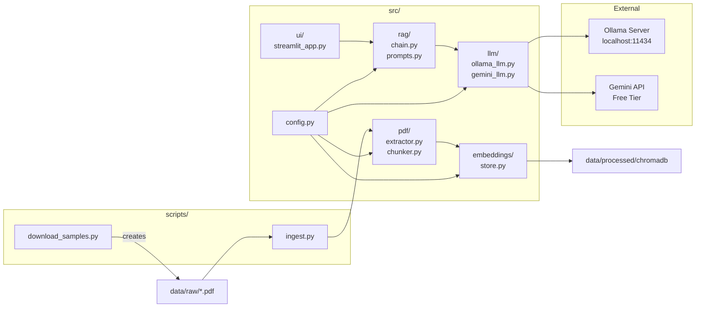
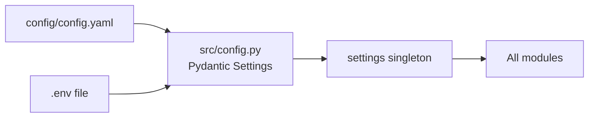
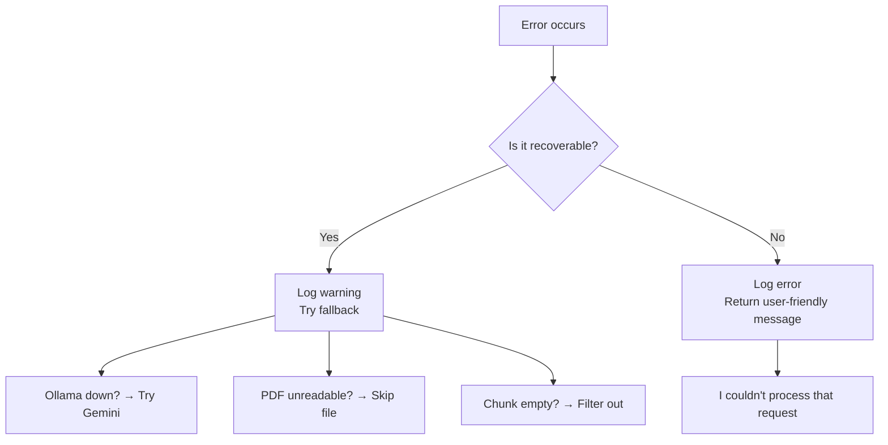
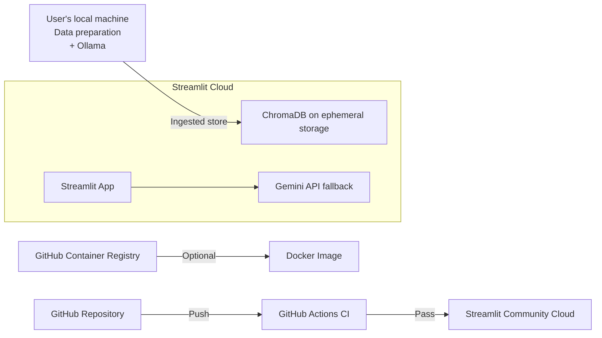

# Architecture

## Data Flow

```mermaid
flowchart TB
    subgraph "1. Data Preparation"
        A1[PDF in data/raw/] --> A2[PyMuPDF\nExtract Pages]
        A2 --> A3[LangChain\nRecursive Splitter]
        A3 --> A4[sentence-transformers\nEmbed Chunks]
        A4 --> A5[ChromaDB\nPersistent Store]
    end

    subgraph "2. Query Processing"
        B1[User Question\n(Arabic or English)] --> B2[sentence-transformers\nEmbed Query]
        B2 --> B3[ChromaDB\nSimilarity Search]
        B3 --> B4[Top-K Chunks\nwith Scores]
    end

    subgraph "3. Answer Generation"
        C1[System Prompt] --> C2[LLM\nOllama / Gemini]
        B4 --> C2
        C2 --> C3[Cited Answer\nwith [page X]]
    end

    A5 -.-> B3
    C3 --> D[Streamlit UI]
    B1 -.-> D
```

## Component Diagram



## Directory Intent

| Directory | Responsibility | Who Writes |
|-----------|---------------|------------|
| `src/pdf/` | Extract text from PDFs, split into chunks | Phase 2 |
| `src/embeddings/` | Embed chunks, store/search in ChromaDB | Phase 3 |
| `src/rag/` | Build RAG chain, define prompts, memory | Phase 4 |
| `src/llm/` | Abstract LLM interface (Ollama + Gemini) | Phase 1 |
| `src/ui/` | Streamlit chat frontend | Phase 4 |
| `src/api/` | FastAPI backend endpoints | Phase 5 (v2) |
| `src/utils/` | Logging, helpers (language detection, file hashing) | Phase 0 |
| `config/` | YAML configuration read by src/config.py | Phase 0 |
| `scripts/` | CLI tools (ingest, download, evaluate) | Phase 0 |
| `tests/` | Pytest test suite | All phases |
| `data/raw/` | Input PDFs (user places here) | User |
| `data/processed/` | ChromaDB persistent storage (generated) | Phase 3 |

## Configuration Flow



Priority: `.env` values override `config.yaml` values.

## Language Detection Strategy

```python
# src/utils/helpers.py
def is_arabic_text(text: str) -> bool:
    """Returns True if >30% of characters are in Arabic Unicode blocks."""
    arabic_chars = sum(1 for c in text if '\u0600' <= c <= '\u06FF')
    return (arabic_chars / len(text)) > 0.3
```

Used by:
- RAG chain to select prompt language
- LLM query to instruct "answer in same language"

## Error Handling Flow



## Deployment Architecture


